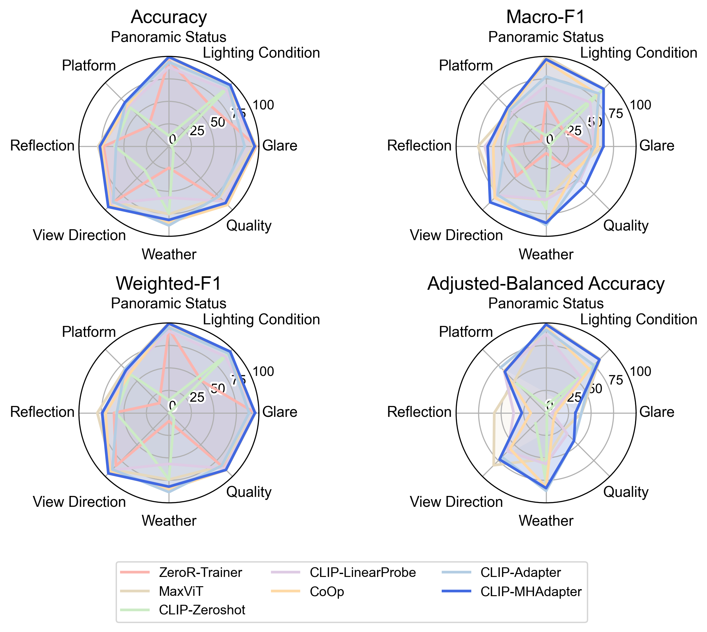

# CLIP-MHAdapter: Parameter-Efficient Multi-Head Self-Attention Adapter for Street-View Image Classification

This repository contains the MSc Research project for CEGE0049, focused on global street scene classification using CLIP-based few-shot learning frameworks such as Dassl and CoOp. The goal is to classify scene conditions (weather, glare, and lighting) from street-level images with the dataset Global Streetscapes (Published: https://doi.org/10.1016/j.isprsjprs.2024.06.023), leveraging vision-language models.

This repository implements **CLIP-MHAdapter**, a lightweight and parameter-efficient method for adapting CLIP to street-view image attribute classification. Instead of fully fine-tuning the large CLIP backbone, the approach introduces a multi-head self-attention adapter that refines patch-level token representations, enabling the model to better capture localized visual cues in cluttered urban scenes. Built on top of Dassl and CoOp, the framework leverages the Global StreetScapes dataset to classify scene conditions such as weather, glare, and lighting. With only ~1.38M trainable parameters (≈1% of full fine-tuning), CLIP-MHAdapter achieves competitive or superior performance compared to strong baselines, offering an efficient solution for fine-grained urban imagery understanding.



This repository depends on:
- `Git` Required for cloning repositories and running scripts via Bash (git clone, bash setup.sh, etc.).
- `PyTorch` Core deep learning framework used for model training and inference.
- `CLIP` A vision-language model (VLM) from OpenAI used for aligning images and text in a shared embedding space.
- `Dassl.pytorch` A domain adaptation and generalization framework built on PyTorch, provides training infrastructure.
- `CoOp` A method built on top of CLIP for few-shot learning using prompt tuning.
- `Hugging Face Hub` Used to download datasets directly through its API if required.

The complete expreimental results is available at [UCL OneDrive](https://liveuclac-my.sharepoint.com/:u:/g/personal/ucesqyo_ucl_ac_uk/EcUXpi7QAVxDn3cN7TyOz5ABvMUWPn9N0OLA4OJF1qZYbw?e=dQIuhU).

## Installations

### 1. Prerequisites

First, clone this repository to your local machine:  
```bash
git clone https://github.com/Qi-YOU/CEGE0049-GSS-Dassl-CoOp.git
cd CEGE0049-GSS-Dassl-CoOp
```

One cloned, make sure you have the following installed:

- Miniconda or Anaconda
- NVIDIA GPU with CUDA 12.8 support (CUDA >= 12.8)
- Python 3.10

### 2. Clone Dependency Repository

Install these dependencies using shallow clones (--depth 1) to save time and bandwidth by skipping full git history:

```bash
# Dassl
git clone --depth 1 https://github.com/KaiyangZhou/Dassl.pytorch.git
```

```bash
# CLIP
git clone --depth 1 https://github.com/openai/CLIP.git
```

```bash
# CoOp
git clone --depth 1 https://github.com/KaiyangZhou/CoOp.git
```

### 2. Environmental Setup

- For Linux:
    Make sure the setup script is executable and then run it:
    ```bash
    # Ensure the script is executable
    chmod +x scripts/setup_venv.sh
    ```
    ```bash
    # Run the script
    ./scripts/setup_venv.sh
    ```
-  For Windows (via Git Bash or Conda Prompt):
    Open an Anaconda Prompt window, keep it in the `base` environment, and execute these commands:
    
    i. Ensure Git Bash is available in your PATH:
    ```bash
    # Add Git's Bash to PATH (adjust the path if Git is installed elsewhere)
    set PATH=C:\Program Files\Git\bin;%PATH%
    ```
    ii. Then verify Bash is available:
    ```
    bash --version
    ```
    iii. Make sure the setup script is executable and then run it:
    ```bash
    # Ensure the script is executable
    # chmod +x scripts/setup_venv.sh
    ```
    ```bash
    # Run the script with Git Bash
    bash scripts/setup_venv.sh
    ```

Note: Depending on your internet speed, the setup process may take 5–10 minutes to complete.

If you encounter errors while installing packages, please double-check your network connection and the availability of relevant Conda or PyPI channels.

This script may prompt you to press a key to continue at certain steps, giving you a moment to review your system status before proceeding.

### 3. Download & Prepare Dataset
Please follow the instructions on the official dataset repository wiki:
https://huggingface.co/datasets/NUS-UAL/global-streetscapes

The following directories has to be downloaded:
```
manual_labels/ (approx. 23 GB)
├── train/
│   └── 8 CSV files with manual labels for contextual attributes 
├── test/
│   └── 8 CSV files with manual labels for contextual attributes 
└── img/
    └── 7 tar.gz files containing images for training and testing
```
Place these directories under `../autodl-tmp` and rename dir name `manual_labels` to `global_street_scapes`.

**Important:**
- After downloading the 7 .tar.gz files in the img/ directory, make sure to extract each archive.
- Extraction will create folders named 1/ through 7/, each containing images in .jpeg format.
- The full dataset, after extraction, may occupy 20-30 GB of disk space.


Once correctly downloaded and prepared, the result directory structure should look like:
```
global_street_scapes/
├── img/
│   ├── 1/
|   |   ├── xx.jpeg
|   |   └── ...
│   ├── 2/
│   ├── 3/
│   ├── 4/
│   ├── 5/
│   ├── 6/
│   └── 7/
├── train/
│   ├── glare.csv
│   ├── ...
│   └── weather.csv
└── test/
    ├── glare.csv
    ├── ...
    └── weather.csv

```

where each diretory named after `1` to `7` contains images in `.jpeg` format.

### 4. Sync Project Files to CoOp
Before running the execution pipeline that utilizes CoOp, make sure required files are correctly placed across dependencies like CoOp/, CLIP/, etc.

- For Linux/macOS:
    ```bash
    # Ensure the script is executable
    chmod +x scripts/sync_files.sh

    # Run the script
    ./scripts/sync_files.sh
    ```

- For Windows (Git Bash or Conda Prompt):
    ```bash
    # Ensure the script is executable
    # chmod +x scripts/sync_files.sh

    # Run the script
    bash scripts/sync_files.sh
    ```

This script verifies the working directory and copies necessary files into appropriate submodules.

## Executions
This repo provides two automation scripts:

- **`run-grid-search.sh`** → Explore hyperparameter combinations for CLIP MHAdapter.  
- **`run-comparison.sh`** → Benchmark CLIP MHAdapter against baseline models (ZeroshotCLIP, Linear Probe, CoOp, CLIP Adapter, ZeroR).  

Both scripts produce experiment logs and summary files.

### 1. Grid Search (CLIP MHAdapter)
The script runs over:
- Loss: `ce`
- Class Weighting: `inverse`, `uniform`
- Blend Ratio: `0.2`, `0.8`
- Num Heads: `4`, `8`, `16`

To conduct grid search:
```bash
bash run-grid-search.sh
```
* Outputs saved in:

  ```
  /root/autodl-tmp/results/<dataset>/clip-vitb16-mh_<heads>-ce-<weight>-br_<blend>
  ```
* Summary log:

  ```
  train_summary.txt
  ```

### 2. Model Comparison
This script compares CLIP MHAdapter against several baselines under controlled settings.
- For CLIP MHAdapter, results are reported using its best macro-F1 score configuration.
- For baselines, a pre-specified hyperparameter search space is pre-defined to ensure fairness.
    - `ZeroR`, `Linear Probe` and `CLIP Adapter` are evaluated without additional arguments, except for enabling class weighting.
    - For `CoOp`, the number of context toke (N_CTX) is restircted to 8 rather than the default value 16, matching other methods that do not modifiy the textual branch of the CLIP backbone, again to ensure fair comparison.
- Runtime is logged for all methods.

To conduct model comparison:
```bash
bash run-comparison.sh
```
* Outputs saved in:

  ```
  /root/autodl-tmp/results/<dataset>/<trainer>-clip-vitb16-...
  ```
* Summary log:

  ```
  /root/autodl-tmp/results/comparison_summary.txt
  ```

### 3. Customized Command Templates
You can also run experiments manually without the helper scripts.  
Below are the template commands and explanations for each placeholder.

**CLIP MHAdapter**
```bash
python CoOp/train.py \
  --trainer CLIP_MHAdapter \
  --dataset-config-file CoOp/configs/datasets/<DATASET>.yaml \
  --config-file configs/vit_b16-adamw.yaml \
  --output-dir /root/autodl-tmp/results/<DATASET>/clip-vitb16-mh_<HEADS>-ce-<WEIGHT>-br_<BLEND> \
  --seed 42 \
  TRAINER.LOSS.NAME ce \
  TRAINER.LOSS.CLASS_WEIGHTING <inverse|uniform> \
  MODEL.BLEND_RATIO <0.2|0.8> \
  MODEL.NUM_HEADS <4|8|16>
```

- `<DATASET>` → one of the datasets (e.g., `glare`, `quality`, `weather`).
- `<WEIGHT>` → class weighting strategy: `inverse` or `uniform`.
- `<BLEND>` → blend ratio value: `0.2` or `0.8`.
- `<HEADS>` → number of attention heads (`4`, `8`, or `16`).
  - Example: `MODEL.NUM_HEADS 8` will configure MHAdapter with 8 heads.
- All runs use a fixed random seed (`42`) for reproducibility.

### 4. Notes
- Switch between Linux and Windows paths inside the scripts before running.
- Best hyperparameters from `run-grid-search.sh` are used by `run-comparison.sh` for the proposed method CLIP-MHAdapter.